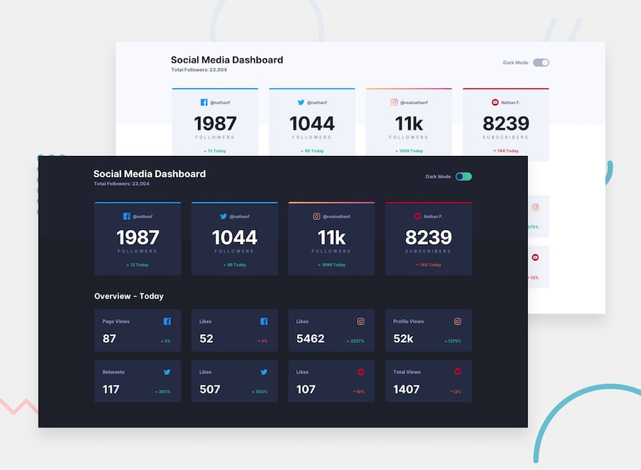

# Social Media Dashboard

This project is my solution to the Frontend Mentor "Social media dashboard with theme switcher" challenge.

I built a responsive dashboard using semantic HTML, SCSS, JavaScript, and a Gulp workflow. The project includes a light/dark theme toggle, reusable card components, responsive layout behavior, and a small build pipeline that compiles SCSS and JavaScript into the `dist` folder.



## Overview

The goal of this project was to recreate the supplied dashboard design as closely as possible and make it responsive across screen sizes.

Users can:

- view a responsive layout for mobile and desktop
- see hover states on cards and controls
- switch between light and dark themes
- keep the selected theme in `localStorage`
- fall back to the system color preference on first load

## What I Built

This project contains:

- a header section with a dashboard title and theme toggle
- a top summary section for main social media statistics
- an overview section with smaller metric cards
- theme handling through CSS custom properties and JavaScript
- a Gulp-based workflow for compiling SCSS and JS

## Tech Stack

- HTML5
- SCSS
- CSS custom properties
- JavaScript
- Gulp
- Sass
- Babel
- BrowserSync
- Autoprefixer
- CSSNano

## How The Project Works

### Layout

The page is divided into:

- a header
- a main statistics card section
- an overview card section

Flexbox is used in the header, and CSS Grid is used for the card layouts.

### Theme Switching

The theme system works in two layers:

1. CSS variables define the default colors for light mode and dark mode.
2. JavaScript adds either `body.dark` or `body.light` and saves that value in `localStorage`.

On first load:

- the app checks `localStorage`
- if nothing is saved, it reads `prefers-color-scheme`
- it then applies the correct body class and syncs the radio toggle state

### Build Process

Gulp handles the development workflow:

- SCSS from `app/scss/Style.scss` is compiled into `dist/Style.css`
- JavaScript from `app/js/script.js` is transpiled and minified into `dist/script.js`
- BrowserSync serves the project and refreshes the browser during development

## Paths Used In This Project

These are the main paths used in the project and what they do.

### Main entry files

- `index.html`  
  Main HTML file for the dashboard.

- `app/scss/Style.scss`  
  Main SCSS entry file. It pulls together globals, utilities, and components.

- `app/js/script.js`  
  Main JavaScript file for theme switching.

- `gulpfile.js`  
  Build and development workflow configuration.

### Compiled output

- `dist/Style.css`  
  Compiled stylesheet loaded by the HTML file.

- `dist/script.js`  
  Compiled JavaScript loaded by the HTML file.

### SCSS structure

- `app/scss/globals/boilerplate.scss`  
  Base reset and global body styles.

- `app/scss/globals/colors.scss`  
  CSS custom properties for both light and dark themes.

- `app/scss/globals/typography.scss`  
  Typography styles for headings and links.

- `app/scss/globals/layout.scss`  
  Shared container spacing and layout rules.

- `app/scss/components/header.scss`  
  Header layout and subtitle styling.

- `app/scss/components/card.scss`  
  Main social media cards and shared card styles.

- `app/scss/components/card-grid.scss`  
  Grid layout for the overview cards.

- `app/scss/components/toggle.scss`  
  Theme toggle UI styling.

- `app/scss/util/functions.scss`  
  Utility Sass functions such as `rem()`.

- `app/scss/util/breakpoints.scss`  
  Breakpoint mixins for responsive design.

### Asset paths used in HTML

The HTML currently uses these asset paths:

- `./dist/Style.css`
- `./dist/script.js`
- `./images/favicon-32x32.png`
- `/images/icon-facebook.svg`
- `/images/icon-twitter.svg`
- `/images/icon-instagram.svg`
- `/images/icon-youtube.svg`
- `/images/icon-up.svg`
- `/images/icon-down.svg`

## Project Structure

```text
social_media_dashboard/
├── app/
│   ├── js/
│   │   └── script.js
│   └── scss/
│       ├── components/
│       │   ├── card-grid.scss
│       │   ├── card.scss
│       │   ├── header.scss
│       │   ├── toggle.scss
│       │   └── _index.scss
│       ├── globals/
│       │   ├── boilerplate.scss
│       │   ├── colors.scss
│       │   ├── fonts.scss
│       │   ├── layout.scss
│       │   ├── typography.scss
│       │   └── _index.scss
│       ├── util/
│       │   ├── breakpoints.scss
│       │   ├── functions.scss
│       │   └── _index.scss
│       └── Style.scss
├── dist/
│   ├── Style.css
│   └── script.js
├── images/
├── design/
├── gulpfile.js
├── index.html
└── README.md
```

## Key Concepts Used

### 1. CSS Custom Properties

I used CSS variables to manage theme colors. This made it easier to switch themes without rewriting individual component styles.

### 2. Sass File Organization

I split styles into:

- `globals` for base project styles
- `components` for reusable UI sections
- `util` for helper mixins and functions

This made the code easier to read and scale.

### 3. Responsive Design

I used breakpoint mixins to handle layout changes between smaller and larger screens.

### 4. DOM Events And State

The theme toggle uses:

- DOM selection
- `change` event listeners
- `localStorage`
- `matchMedia('(prefers-color-scheme: dark)')`

## Development Commands

Install dependencies:

```bash
npm install
```

Start the development server with file watching:

```bash
npx gulp
```

Create a production-style build:

```bash
npx gulp build
```

## Notes About The Current Setup

- The SCSS entry file is `Style.scss`, so the compiled CSS file name is `Style.css` with a capital `S`.
- The project uses Gulp directly through `npx gulp` because there is not yet a custom `"start"` script in `package.json`.
- Theme switching is handled in JavaScript and visualized through CSS variables.

## What I Learned

While building this project, I practiced:

- organizing SCSS into partials
- using CSS variables for theme control
- building a responsive card layout with Grid
- using Flexbox for header alignment
- connecting radio inputs to JavaScript behavior
- saving UI state in `localStorage`
- using Gulp to compile and serve a frontend project

## Possible Next Improvements

- clean up the placeholder page title and attribution text
- convert remaining image paths to consistent relative paths
- add custom npm scripts like `dev` and `build`
- replace deprecated Sass `map-get()` usage with `map.get()`
- deploy the project and add live links

## Challenge Source

Frontend Mentor challenge:

- https://www.frontendmentor.io/challenges/social-media-dashboard-with-theme-switcher-6oY8ozp_H

## Author

- GitHub: https://github.com/kirat11X/social_media_dashboard

